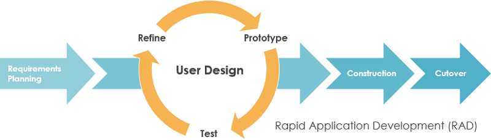

# Nome do Projeto

O Sistema de Gerenciamento de Alunos (RAD) é uma aplicação desktop desenvolvida em Python usando a biblioteca tkinter para a interface gráfica. O objetivo do projeto é permitir que professores ou administradores de escolas possam registrar e acompanhar o desempenho dos alunos, calculando suas médias e situação (aprovado, em recuperação ou reprovado) com base nas notas de dois semestres.

## Recursos

- Cadastro de alunos com nome, nota do primeiro semestre e nota do segundo semestre.
- Cálculo automático da média e da situação do aluno.
- Visualização dos alunos cadastrados em uma tabela (TreeView) com recursos de rolagem.
- Salvamento dos dados em uma planilha Excel para consultas futuras.
- Interface amigável e fácil de usar.

## Requisitos

- Python 3.x instalado no sistema.
- Bibliotecas utilizadas: tkinter, pandas.
